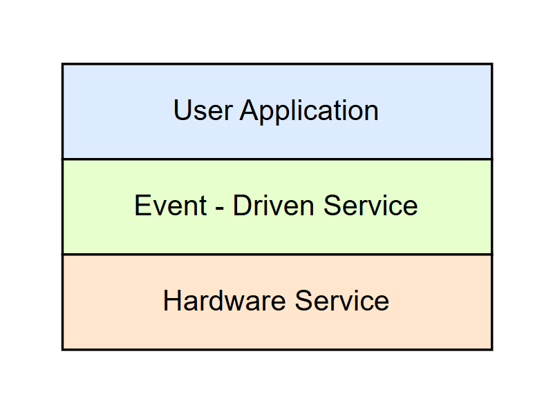
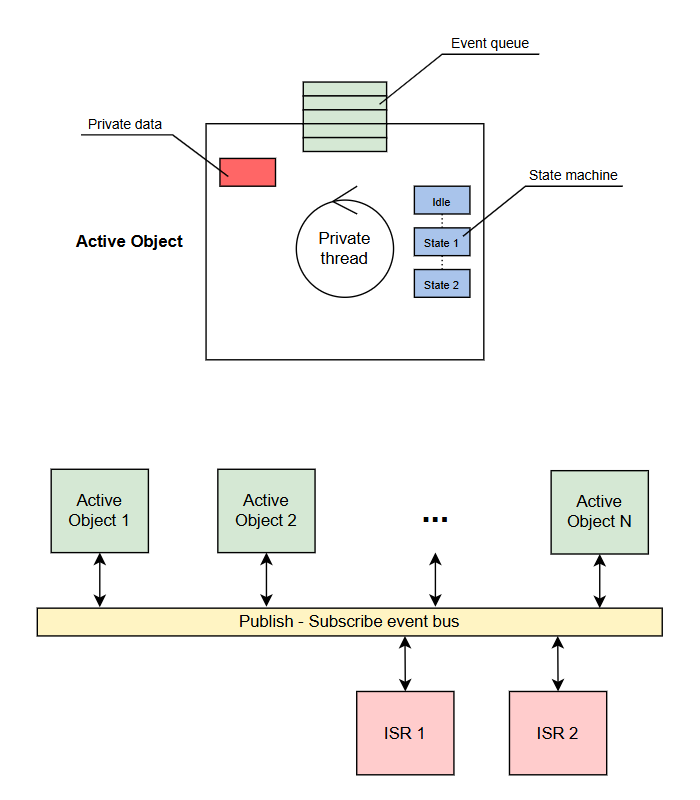
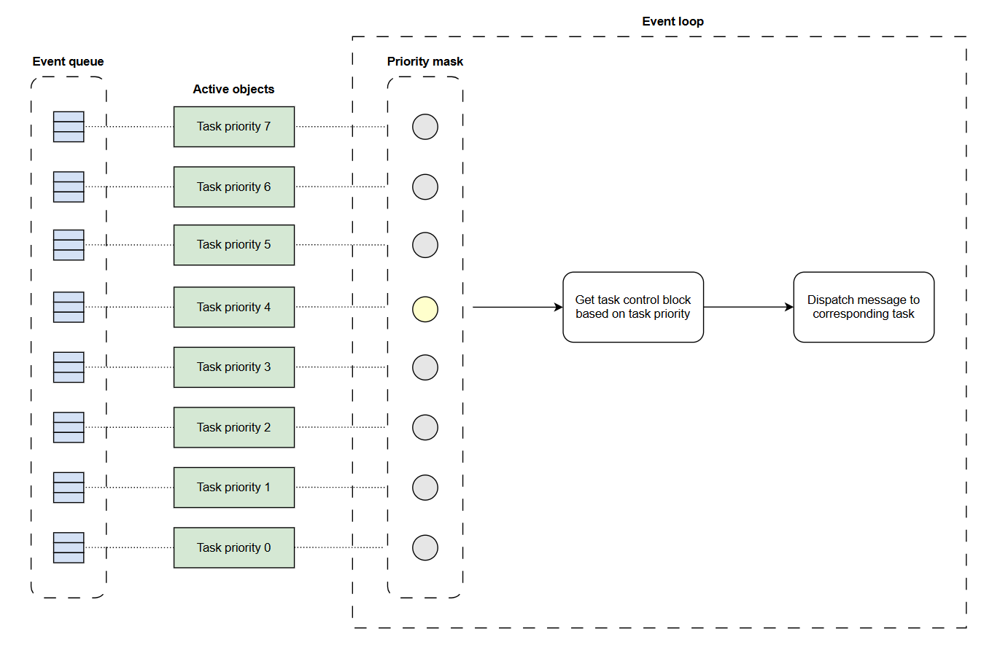
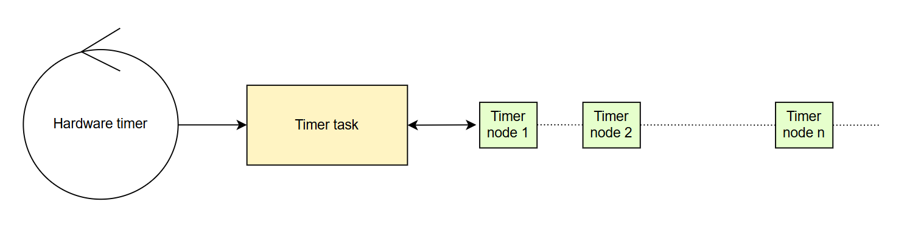

## Lite Thread Kernel
Lite Thread is built as a framework to manage execution tasks in embedded software development on microcontrollers. Built on Active Objects design pattern architecture with the following advantages:
- Low memory usage
- Modularized, operates independently of the microcontroller's driver library
- Easy porting on different microcontroller lines, helping users to quickly develop applications.

In this model, **Lite Thread** is built to work with a bare-metal project (non-OS), with an event-driven service layer located above the **hardware service** layer.

    

To approach this model, learners need to have basic knowledge of data structures: Linked list, queue, pool memory, OOP. This commit will include the following contents:
- Pool memory
- Post & handling messages mechanisms
- Timer list

### 1. Active Object Design Pattern

    

Active objects (a.k.a. actors) are event-driven, strictly encapsulated software objects endowed with their
own threads of control that communicate with one another asynchronously by exchanging events. The
UML specification further proposes the UML variant of hierarchical state machines (UML statecharts )
with which to model the behavior of event-driven active objects.
Active objects inherently support and automatically enforce the following best practices of concurrent
programming:
- Keep all of the thread's data encapsulated and local, bound to the task itself and hidden from the
rest of the system.
- Communicate among threads asynchronously via intermediary event objects. Using asynchronous
event posting keeps the tasks running truly independently without blocking on each other.
- Threads should spend their lifetime responding to incoming events, so their mainline should consist of
an event loop.
- Threads should process events one at a time (run to completion), thus avoiding any concurrency
hazards within a thread itself.

### 2. Task - Signal Concept
The scheduler works with the following idea:

    

**Event queue**
- The task arrangement model is based on a priority-based mechanism, with 8 different priorities from low to high, each of which is represented by an active object.
- Each task control block (active object) will have its own message queue. If the tasks have the same priority, it will be managed by an active object.

**Event loop**
- When a message is sent (message from the application, message from the ISR, ...), it will forward the message to the corresponding active object and set the mask to move the active object from idle state to ready to run.
- The event loop will continuously check the priority mask table to determine that the active object with the highest priority is in the ready to run state.
- If there are many active objects ready to run, it will let the active object with the higher priority run first. In the same active object, the message that arrives first will be processed first.
- If all active objects are set to idle (ie all message queues are empty), it will run polling objects.

### 3. Timer service
Timers in event-driven systems operate on the following principle:

    

- When a timer node is installed, it will move this node to the timer list (this list is built based on the linked list).

- The timer task (managed by the active object) will perform the task of browsing this timer list to check if the timer of a node has expired. If so, it will dispatch a message to the corresponding task. This timer task will operate continuously during run-time.

- The timer heartbeat is handled by a real timer on the microcontroller (system tick timer, hardware timer,...).

- During application development, with the convenience of this timer service, the timer can be called and deleted anywhere, even during run-time.

### 4. Usage
In this sample code, built on the Makefile project.
Here are the instructions:
- STM32Cube IDE: **Updating**
- Arduino IDE: **Updating**

### 5. References:
| Topic | Link |
| ------ | ------ |
| Active Object Model | https://www.state-machine.com/doc/AN_Active_Objects_for_Embedded.pdf |
| AK Embedded Base Kit | https://github.com/epcbtech/ak-base-kit-stm32l151 |
|Super Simple Tasker |https://github.com/QuantumLeaps/Super-Simple-Tasker|